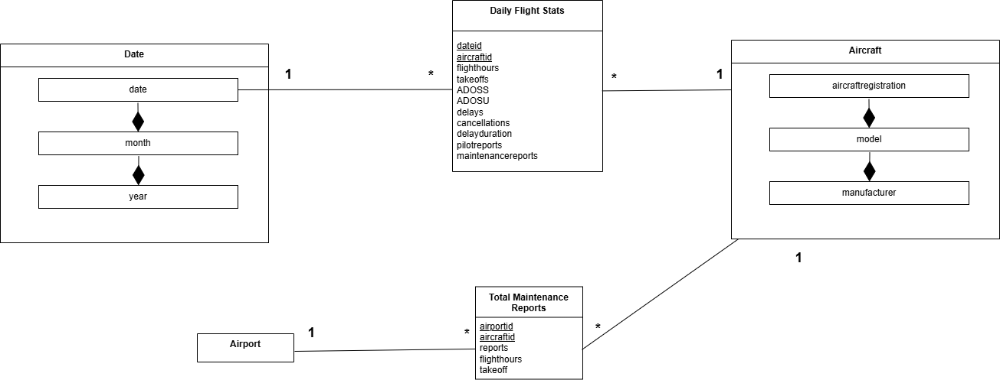
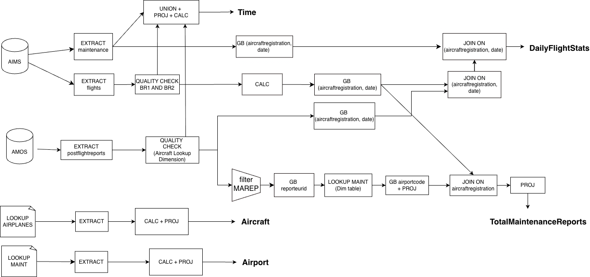
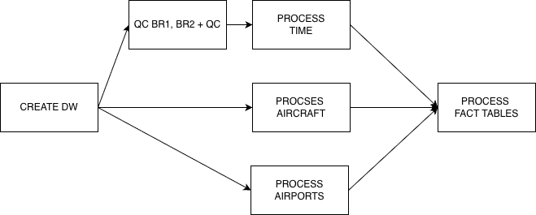

# Aviation Fleet Analytics Data Warehouse

A complete Extract-Transform-Load (ETL) pipeline and analytical data warehouse for aviation fleet performance analysis. This project processes flight operations data from PostgreSQL (AIMS/AMOS systems) and loads it into a DuckDB data warehouse optimized for computing aircraft utilization and reliability KPIs.

This project was developed as part of the **Advanced Databases (BDA)** course in the Bachelor's Degree in Data Science and Engineering at Universitat Politecnica de Catalunya (UPC).

---

## Table of Contents

- [Overview](#overview)
- [Features](#features)
- [Architecture](#architecture)
- [Project Structure](#project-structure)
- [Design Decisions](#design-decisions)
- [Data Warehouse Schema](#data-warehouse-schema)
- [ETL Process Design](#etl-process-design)
- [Query Performance](#query-performance)
- [Key Performance Indicators](#key-performance-indicators)
- [Installation](#installation)
- [Configuration](#configuration)
- [Usage](#usage)
- [Technologies](#technologies)
- [Authors](#authors)

---

## Overview

This project implements a data warehouse solution for analyzing aircraft fleet operations for the fictional airline ACME Flying. The system extracts data from operational systems:

- **AIMS** (Airline Information Management System): Contains flight schedules, actual flight data, and maintenance records
- **AMOS** (Aircraft Maintenance and Operations System): Contains post-flight reports from pilots and maintenance crews

The ETL pipeline applies business logic transformations and loads the processed data into a star schema optimized for OLAP queries. This enables comparison of fleet performance metrics between manufacturers (Airbus vs. Boeing) across multiple dimensions including time, aircraft, and airports.

---

## Features

- **Complete ETL Pipeline**: Modular Python-based extraction, transformation, and loading process
- **Star Schema Data Warehouse**: Optimized for analytical queries with 3 dimensions and 2 fact tables
- **Data Quality Controls**: Automatic handling of overlapping flights, invalid dates, and missing aircraft references
- **KPI Computation**: Pre-built queries for standard aviation fleet metrics
- **Manufacturer Comparison**: Built-in support for comparing Airbus vs. Boeing fleet performance
- **40-50x Query Speedup**: Queries on the DW are significantly faster than source system queries

---

## Architecture

```
+------------------------------------------------------------------+
|                        DATA SOURCES                               |
+-------------------------------+----------------------------------+
|   PostgreSQL (DBBDA)          |         CSV Files                |
|   - AIMS.flights              |   - aircraft-manufacturerinfo    |
|   - AIMS.maintenance          |   - maintenance_personnel        |
|   - AMOS.postflightreports    |                                  |
+-------------------------------+----------------------------------+
                                    |
                                    v
+------------------------------------------------------------------+
|                      ETL PIPELINE (src/)                          |
+------------------------------------------------------------------+
|  extract.py -> transform.py -> load.py                            |
|                                                                    |
|  - Flight data extraction     - Date code generation              |
|  - Maintenance data           - Flight duration calculation       |
|  - Report extraction          - Delay computation                 |
|  - Aircraft lookup            - Data validation                   |
|  - Personnel lookup           - Aggregation by date/aircraft      |
+------------------------------------------------------------------+
                                    |
                                    v
+------------------------------------------------------------------+
|               DATA WAREHOUSE (DuckDB)                             |
+------------------------------------------------------------------+
|  Dimensions:              |  Fact Tables:                         |
|  - Aircrafts              |  - DailyAircraftStats                 |
|  - Date                   |  - TotalMaintenanceReports            |
|  - Airports               |                                       |
+------------------------------------------------------------------+
```

---

## Project Structure

```
aviation-fleet-analytics/
|
|-- run_etl.py                  # Main entry point - runs the ETL pipeline
|-- requirements.txt            # Python dependencies
|-- README.md
|-- .gitignore
|
|-- src/                        # Source code
|   |-- __init__.py
|   |-- etl_control_flow.py     # ETL orchestrator
|   |-- extract.py              # Data extraction from PostgreSQL and CSV
|   |-- transform.py            # Data transformation and business logic
|   |-- load.py                 # Data loading into DuckDB
|   |-- dw.py                   # Data warehouse schema and queries
|
|-- data/
|   |-- lookups/                # Reference data
|   |   |-- aircraft-manufacturerinfo-lookup.csv
|   |   |-- maintenance_personnel.csv
|   |-- dw.duckdb               # Generated DuckDB data warehouse (after ETL)
|
|-- config/
|   |-- db_conf.txt             # Database credentials (not versioned)
|   |-- db_conf.example.txt     # Template for database configuration
|
|-- docs/                       # Documentation
|   |-- images/                 # Diagrams and figures
|   |   |-- Conceptual.drawio.png
|   |   |-- Dataflow.drawio.png
|   |   |-- Controlflow.drawio.png
|   |-- BDAProj1.pdf            # Design decisions document
|   |-- Statement.pdf           # Project statement
|   |-- ACME-flying-use-case.pdf
|
|-- logs/                       # ETL logs and diagnostics
    |-- cleaning.log
    |-- invalid_reports.csv
    |-- overlapping_flights.csv
```

---

## Design Decisions

The data warehouse schema was designed to support all required query types (utilization metrics, reporting rates by manufacturer/year/airport) while maintaining flexibility and performance.



### Multidimensional Schema Rationale

**Date Dimension:**
- Stores metrics at the daily level even though some queries only require monthly aggregation
- Using a single time table provides flexibility and simpler queries
- Splitting into separate date and month tables would require costly joins
- Daily granularity allows capturing additional temporal characteristics (day of week, holidays) for future analysis

**Aircraft Dimension:**
- All aggregation levels (registration, model, manufacturer) stored in one table
- We do not expect the model or manufacturer of aircraft to change
- Saves space (only existing combinations stored) and time (fewer joins)

**Airports Dimension:**
- Kept as a separate dimension table despite having only the airport code
- Designed for scalability: additional airport information may be collected in the future
- Allows for future enhancements (e.g., Airport-Personnel relationships)

**Daily Flight Stats Fact Table:**
- All statistics gathered in a single fact table rather than separate tables by source
- Combining statistics from multiple sources would otherwise require many unnecessary joins
- Daily granularity chosen as the minimum required by the queries
- Stores only minimum aggregates needed to calculate KPIs (not rates directly)
- Report counts stored in 2 attributes by role instead of adding a role dimension

**Total Maintenance Reports Fact Table:**
- Stores historical totals (not daily snapshots) for efficient airport-based queries
- Alternative of adding airport dimension to Daily Flight Stats was rejected:
  - Would increase table size by ~226x (from 6.38M to 1.45B cells)
  - Airport-based temporal analysis is not in the current query requirements

### Size Comparison

| Implementation | Daily Flight Stats | Total Maint. Reports | Total Size |
|----------------|-------------------|---------------------|------------|
| Two tables (chosen) | 6.02 x 10^6 | 3.60 x 10^5 | 6.38 x 10^6 |
| Single table | 1.45 x 10^9 | - | 1.45 x 10^9 |

*Assumptions: 5 years of data, ~240 airports, ~300 aircraft*

---

## Data Warehouse Schema

### Dimension Tables

| Table | Key | Attributes |
|-------|-----|------------|
| **Aircrafts** | `aircraftid` | `aircraftregistration`, `model`, `manufacturer` |
| **Date** | `dateid` | `date`, `month` (YYYYMM), `year` (YYYY) |
| **Airports** | `airportid` | `airportcode` |

### Fact Tables

#### DailyAircraftStats

Granularity: One row per aircraft per day

| Measure | Description |
|---------|-------------|
| `takeoffs` | Number of takeoffs |
| `flighthours` | Total flight hours |
| `ADOSS` | Aircraft Days Out of Service (Scheduled) |
| `ADOSU` | Aircraft Days Out of Service (Unscheduled) |
| `delays` | Number of delayed flights (>15 min) |
| `cancellations` | Number of cancelled flights |
| `delayduration` | Total delay duration in minutes |
| `pilotreports` | Number of pilot reports (PIREP) |
| `maintenancereports` | Number of maintenance reports (MAREP) |

#### TotalMaintenanceReports

Granularity: One row per aircraft per airport (historical totals)

| Measure | Description |
|---------|-------------|
| `reports` | Total number of reports |
| `takeoffs` | Total takeoffs from airport |
| `flighthours` | Total flight hours from airport |

---

## ETL Process Design

The ETL was designed using the **pygrametl** Python library, ensuring modular and parallelizable data extraction and transformation.





### Extract Phase
- No transformations applied during extraction; raw data passed to transform functions
- All sources extracted as streams (CSVSource, SQLSource) for non-blocking operations
- SQL queries include projections to keep only necessary attributes
- ETL process stops if any extraction fails

### Transform Phase
- Quality checks performed as early as possible to discard invalid data
- During flights quality check, data transformed to DataFrame for blocking operations (overlap detection)
- Business Rules applied:
  - BR-21: Overlapping flight slots detection
  - BR-22: Swapped departure/arrival times correction
  - Aircraft existence validation for post-flight reports
- Aggregation performed before joins to minimize comparisons
- Joins performed on smallest result sets first
- Only years contained in AIMS.flights used (matching baseline query behavior)

### Load Phase
- Entire process stops on any loading error
- Dimensions loaded first, then fact tables

### Control Flow Dependencies
1. Aircraft and Airports dimensions have no dependencies (loaded first)
2. Data cleaning precedes both Time dimension and fact table creation
3. Time dimension created from union of valid dates across all tables
4. Fact tables created after all dimensions are loaded

---

## Query Performance

| Query | Data Warehouse | Baseline (Source) | Speedup |
|-------|---------------|-------------------|---------|
| Utilization | 0.019s | 0.969s | ~51x |
| Reporting | 0.010s | 0.425s | ~43x |
| Reporting per Role | 0.010s | 0.382s | ~38x |

The significant performance improvement (40-50x faster) demonstrates how the DW design with optimized fact and dimension tables, surrogate indexes, and pre-aggregated data enables efficient querying and rapid analytical insights.

All query results were verified to be identical between DW and source systems, confirming the correctness of the ETL process.

---

## Key Performance Indicators

The data warehouse supports computation of industry-standard KPIs:

| KPI | Full Name | Description |
|-----|-----------|-------------|
| **FH** | Flight Hours | Annual flight hours per aircraft |
| **TakeOff** | Flight Cycles | Annual takeoffs per aircraft |
| **ADOSS** | Days Out of Service (Scheduled) | Planned maintenance days |
| **ADOSU** | Days Out of Service (Unscheduled) | Unplanned maintenance days |
| **ADOS** | Days Out of Service | Total out-of-service days |
| **ADIS** | Days In Service | Operational days (365 - ADOS) |
| **DU** | Daily Utilization | FH / (ADIS x 24) |
| **DC** | Daily Cycles | TakeOff / ADIS |
| **DYR** | Delay Rate | (Delays / TakeOff) x 100 |
| **CNR** | Cancellation Rate | (Cancellations / TakeOff) x 100 |
| **TDR** | Technical Dispatch Reliability | 100 - DYR - CNR |
| **ADD** | Average Delay Duration | Total delay minutes / Number of delays |
| **RRh** | Reporting Rate per FH | (Reports / FH) x 1000 |
| **RRc** | Reporting Rate per Cycle | (Reports / TakeOff) x 100 |

---

## Installation

### Prerequisites

- Python 3.10+
- Access to the source PostgreSQL database (DBBDA)

### Setup

1. **Clone the repository**
   ```bash
   git clone https://github.com/yourusername/aviation-fleet-analytics.git
   cd aviation-fleet-analytics
   ```

2. **Create a virtual environment** (recommended)
   ```bash
   python -m venv venv
   source venv/bin/activate  # On Windows: venv\Scripts\activate
   ```

3. **Install dependencies**
   ```bash
   pip install -r requirements.txt
   ```

---

## Configuration

1. **Create database configuration file**
   
   Copy the example configuration and fill in your credentials:
   ```bash
   cp config/db_conf.example.txt config/db_conf.txt
   ```

2. **Edit `config/db_conf.txt`** with your PostgreSQL connection details:
   ```
   dbms=postgresql
   ip=your-database-host
   port=5432
   user=your-username
   password=your-password
   dbname=DBBDA
   ```

---

## Usage

### Run the Complete ETL Pipeline

From the project root directory:

```bash
python run_etl.py
```

This will:
1. Create a fresh DuckDB data warehouse (`data/dw.duckdb`)
2. Load dimension tables (Aircrafts, Airports)
3. Extract and clean flight, maintenance, and report data
4. Load the Date dimension
5. Compute and load fact tables

### Query the Data Warehouse

```python
import sys
sys.path.insert(0, 'src')
from dw import DW

# Connect to existing data warehouse
dw = DW(create=False)

# Query utilization metrics by manufacturer and year
utilization = dw.query_utilization()
print(utilization)

# Query reporting rates
reporting = dw.query_reporting()
print(reporting)

# Query reporting rates by role (PIREP vs MAREP)
reporting_by_role = dw.query_reporting_per_role()
print(reporting_by_role)

# Close connection
dw.close()
```

### Baseline Queries (Direct Source Comparison)

For validation, the `extract.py` module includes baseline queries that compute the same KPIs directly from the source PostgreSQL database:

```python
sys.path.insert(0, 'src')
import extract

# Compare DW results with source
baseline_utilization = extract.query_utilization_baseline()
baseline_reporting = extract.query_reporting_baseline()
```

---

## Technologies

| Technology | Purpose |
|------------|---------|
| **Python 3.10+** | Core programming language |
| **DuckDB** | Analytical data warehouse (OLAP-optimized) |
| **pygrametl** | ETL framework for dimensional modeling |
| **psycopg2** | PostgreSQL database connectivity |
| **pandas** | Data manipulation and transformation |
| **tqdm** | Progress bars for ETL operations |

---

## Authors

**Jordi Corbalan Vilaplana** and **Ona Siscart Noguer**

- Bachelor's Degree in Data Science and Engineering (GCED)
- Universitat Politecnica de Catalunya (UPC)
- Course: Advanced Databases (BDA)
- Professor: Albert Abello
- Academic Year: 2025-2026

---

## License

This project was developed for educational purposes as part of the Advanced Databases course at UPC.
